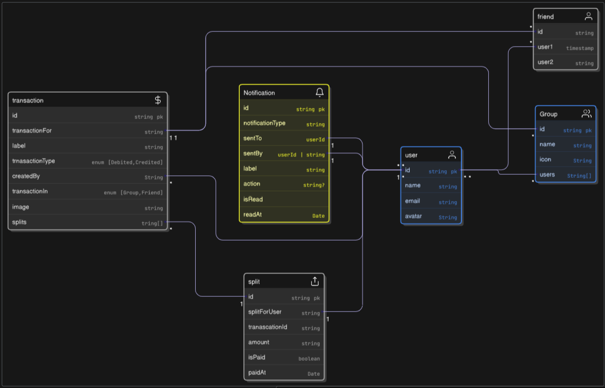

# Splitly

## Objective

Build an android application for **Splitting bills among groups or friends**

## Scope

What we have to do in this project

- User can note hwo much money spent
- Notifications on transaction completion
- Social Auth

What not to do in project

- No email Auth
- No need of chatting

## Features and requirements

## P1

- User should be able to create group
- User should be able to add friends
- User can split bills just with friend
- User can split bills equally
- User can split bills dynamically by entering a certain amount or percentage of total amount

## P2

- Add a “settle up” feature to mark dues as paid.
- Export group transactions as PDF or CSV.
- Add a recurring bill option for things like rent.

## User stories or use case

- I want to keep track of every expense with my flatmates/friends
- I want to make sure they all are aware of where i spent money and how much they owe me with my app
- I want to make sure even time if i add some transaction that splits bill with my friend my friend gets a notification
- I want to remind my friend how much i owe them after certain interval( may be 7 days)

## Technical Requirements

- React Native
- Appwrite

## Design Requirements

- Light theme
- Navbar includes
  - Groups
  - Friends
  - Activity
  - Profile

## Success Metrics

- Is user able to login via social auth ?
- can user create a group and add his friend to that group
- Can user split his bill equally or dynamically

## Timeline

| Task               | Days    | Start Date | End Date   |
| ------------------ | ------- | ---------- | ---------- |
| Basic Setup        | 1 Day   | 03-07-2025 | 03-07-2025 |
| Social Auth        | 1 Day   | 04-07-2025 | 04-07-2025 |
| Profile Page       | 3 Days  | 05-07-2025 | 07-07-2025 |
| Activity           | 2 Days  | 08-07-2025 | 10-07-2025 |
| Groups and Friends | 3 Days  | 11-07-2025 | 13-07-2025 |
| Total              | 10 Days | -          | 13-07-2025 |

# ER Diagram
